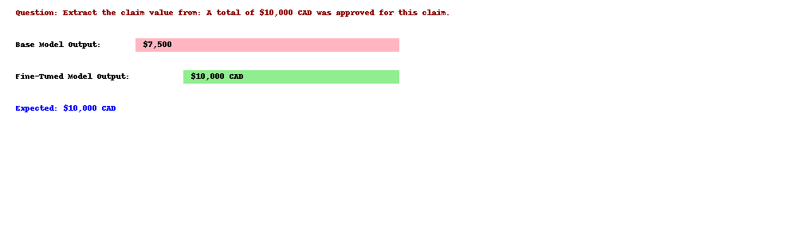
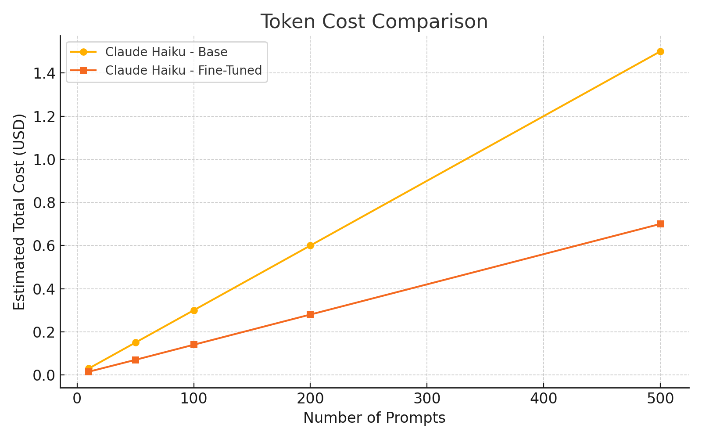

# 🧪 Haiku Fine-Tune Lab

This project simulates the fine-tuning of AWS Claude Haiku for domain-specific tasks like structured information extraction and Q&A.

---

## 🔧 Features

- 📦 Converts training data into Claude-compatible JSONL format
- 🎯 Simulates fine-tuning on custom tasks
- 📊 Evaluates performance with basic metrics
- 🧠 Shows output differences before and after fine-tuning

---

## 📂 Project Structure

```
haiku-finetune-lab/
├── data/
│   ├── training_data.jsonl        # Few-shot or synthetic samples
│   ├── eval_data.jsonl            # Test data for side-by-side outputs
├── haiku_finetuner/
│   ├── prepare_data.py            # Converts raw data into Claude format
│   ├── training_config.yaml       # Placeholder configuration
│   ├── run_finetune.py            # Simulated Bedrock job submission
│   └── evaluate_model.py          # Precision/recall/f1 or exact match
├── notebooks/
│   └── fine_tune_demo.ipynb       # Notebook showing pre vs post fine-tune output
├── README.md
└── requirements.txt
```

---

## 💡 Example Prompt-Completion Training Sample

```json
{
  "prompt": "Extract the total approved amount from the claim: The approved amount is $5,000 CAD.",
  "completion": "$5,000 CAD"
}
```

---

## 📊 Visual Comparison

### Before vs. After Fine-Tuning



### Token Cost Comparison



---

## 🧪 Evaluation

- Accuracy of exact match
- JSON formatting compliance
- Answer location consistency

---

Made with ❤️ by Rahul Chatterjee
